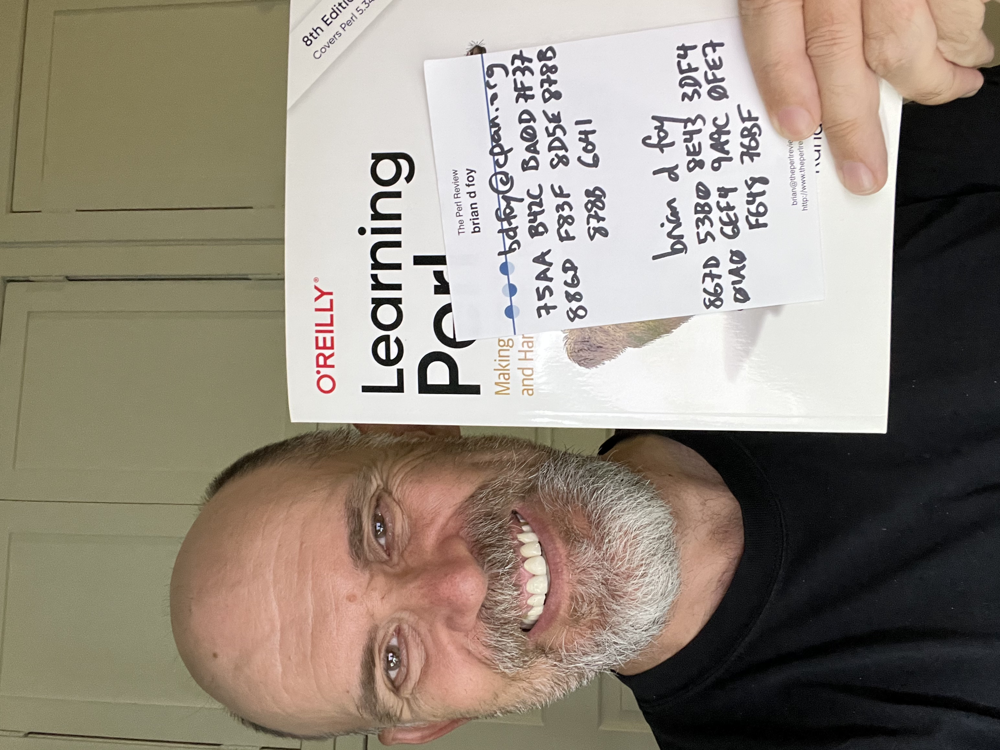

# Help others trust CPAN::Audit

I've started to sign lib/CPAN/Audit/DB.pm with [a GPG key I made for
this module](https://keys.openpgp.org/vks/v1/by-fingerprint/75AAB42CBA0D7F37F0D6886DF83F8D5E878B6041).
The file *lib/CPAN/Audit/DB.pm.gpg* is the detached signature for *lib/CPAN/Audit/DB.pm*.

We can enhance this trust for *lib/CPAN/Audit/DB.pm* by including more
trust in the key that signs that data. You can do this by signing the
key to say that you trust it.

You can sign my personal and my CPAN::Audit key with your key:

     % gpg --keyserver keys.openpgp.org --recv-keys 75AAB42CBA0D7F37F0D6886DF83F8D5E878B6041 867D53B08E433DF401A06EF49A9C0FE7F64876BF
     % gpg --sign-key briandfoy@pobox.com
     % gpg --sign-key bdfoy@cpan.org
     % gpg --output ~/pobox.signed.gpg --export --armor briandfoy@pobox.com
     % gpg --output ~/bdfoy.signed.gpg --export --armor bdfoy@cpan.org

Then send those output files back to *briandfoy@pobox.com*. I will
import them into my keyring and re-export my key to the keyserver.

Here's a selfie with me holding up the two key fingerprints. For the more cautious (not a bad thing here), we can arrange a way to
verify that these keys belong to me and you are sending them to the right
place.

